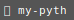
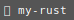
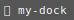

# fittytizio

Here is the list of my projects.

**Python**

  

**Rust**

 

**Docker**

    

---

<a href="TODO">

<svg xmlns="http://www.w3.org/2000/svg" width="74" height="20">
    <rect width="74" height="20" fill="#555"/>
    <text x="4" y="14" fill="#fff" font-family="Consolas,monospace" font-size="11">&#x1F40B; my-dock</text>
</svg>

</a> &nbsp; <a href="TODO">

<svg xmlns="http://www.w3.org/2000/svg" width="74" height="20">
    <rect width="74" height="20" fill="#555"/>
    <text x="4" y="14" fill="#fff" font-family="Consolas,monospace" font-size="11">&#x1F40B; my-dock</text>
</svg>

</a>
